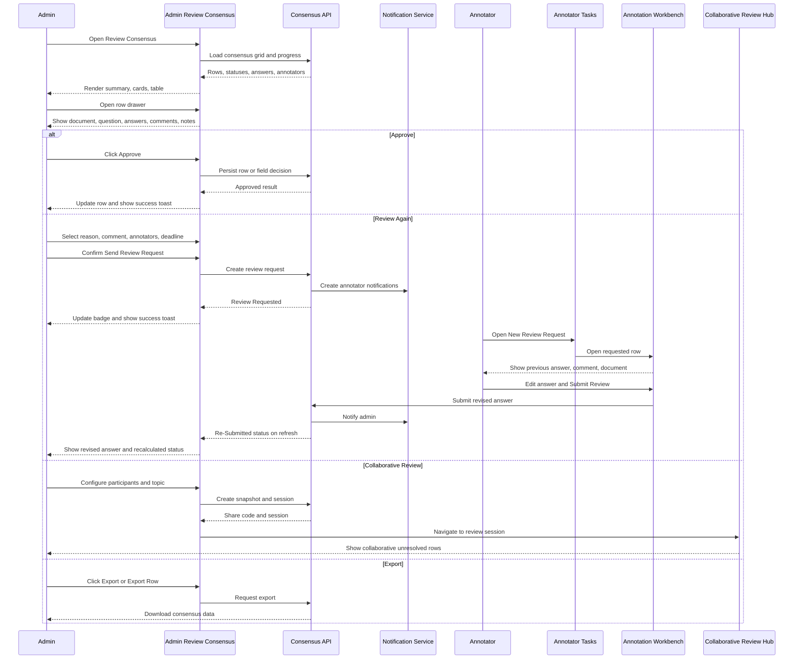

# Review Consensus Workflow

## 1. Row Status Lifecycle

`Created` is an audit event. The row status lifecycle begins when a source row is available to the assigned clone datasets.

```text
Created
  |
  v
Pending
  |
  | first annotator submits
  v
Partial
  |
  | all assigned annotators submit
  +--------------------------+
  |                          |
  | all answers match        | answers differ
  v                          v
Agreed                    Conflict
                               |
                               | no strict majority
                               v
                              Tie

Agreed / Conflict / Tie / Partial
  |
  | admin sends Review Again
  v
Review Requested
  |
  | selected annotator submits revised answer
  v
Re-Submitted
  |
  | consensus is recalculated
  +--> Agreed
  +--> Conflict
  +--> Tie
  +--> Partial

Agreed / resolved Conflict / resolved Tie
  |
  | admin approves
  v
Approved
```

Status definitions:

| Status | Meaning | Admin view |
| --- | --- | --- |
| Pending | No assigned annotator has submitted an answer | Wait or request review only when a correction is required |
| Partial | At least one answer is missing | Inspect pending answers and decide whether to wait or request review |
| Agreed | All submitted answers match | Approve or inspect the row |
| Conflict | All required answers are present but values differ | Compare answers, approve the selected winner, request review, or start collaborative review |
| Tie | No strict majority exists | Compare answers, request review, or start collaborative review |
| Review Requested | Admin sent the row back to selected annotators | Wait for revised submissions |
| Re-Submitted | A requested annotator submitted a revised answer | Recalculate consensus and review again |
| Approved | Admin accepted the final row decision | Row is ready for the next dataset workflow step |

`Rejected` and `Override Winner` are not part of this workflow.

## 2. Admin Decision Matrix

| Current status | Approve | Review Again | Start Collaborative Review | Export Row |
| --- | --- | --- | --- | --- |
| Pending | Disabled until a valid final answer exists | Available only when correction context exists | Disabled unless unresolved rows are available | Available |
| Partial | Disabled until a valid final answer exists | Available | Available when the row is unresolved | Available |
| Agreed | Available | Available if the admin identifies an issue | Optional | Available |
| Conflict | Available after admin selects a valid winner | Available | Available | Available |
| Tie | Available after a collaborative or admin decision exists | Available | Available | Available |
| Review Requested | Disabled while waiting for requested submissions | Available to resend or clarify | Available if other unresolved rows exist | Available |
| Re-Submitted | Available after recalculated consensus is valid | Available | Available if disagreement remains | Available |
| Approved | Disabled or idempotent | Available only if the row is reopened by the product workflow | Disabled for this row | Available |

The approved page exposes only `Approve`, `Review Again`, `Start Collaborative Review`, and `Export Row`.

## 3. Field-Level And Row-Level Review

Consensus is calculated at the field level and displayed at the row level.

```text
Parent Row 25
├── Field: invoice_total
│   ├── Annotator 1 answer
│   ├── Annotator 2 answer
│   └── Annotator 3 answer
├── Field: invoice_date
│   ├── Annotator 1 answer
│   ├── Annotator 2 answer
│   └── Annotator 3 answer
└── Field: vendor_name
    ├── Annotator 1 answer
    ├── Annotator 2 answer
    └── Annotator 3 answer
```

Field-level rules:

- Each field compares answers from the same row across all assigned annotators.
- A field may be Agreed, Conflict, Tie, Partial, Review Requested, or Re-Submitted.
- Field confidence is displayed only when supplied by the annotation response.
- Field answers remain grouped under their annotator in the drawer.

Row-level rules:

- The row status summarizes all field statuses.
- If any required field is Partial, the row cannot be treated as fully Agreed.
- If all required fields are Agreed, the row may be marked Agreed.
- If any field is Conflict or Tie, the row requires attention.
- If a field is sent back, the row is Review Requested until the requested submission returns.
- Approve applies to the row decision while the underlying API may persist the selected field decisions.

## 4. Clone Dataset Relationship

The source dataset remains the parent dataset. Each annotator receives a physical clone assignment that references the same source row indices.

```text
                         Parent Dataset
                         Invoice Dataset
                                |
        +-----------------------+-----------------------+
        |                       |                       |
   Clone Dataset 1        Clone Dataset 2        Clone Dataset 3
   Assigned: A1           Assigned: A2           Assigned: A3
        |                       |                       |
        +-----------------------+-----------------------+
                                |
                    Consensus Aggregation Service
                    compares matching row indices
                                |
                         Review Consensus Grid
                                |
                  Admin Review Consensus page
```

For four through nine annotators, the same relationship continues:

```text
Parent Dataset
├── Clone Dataset 1 -> Annotator 1
├── Clone Dataset 2 -> Annotator 2
├── Clone Dataset 3 -> Annotator 3
├── Clone Dataset 4 -> Annotator 4
├── Clone Dataset 5 -> Annotator 5
├── Clone Dataset 6 -> Annotator 6
├── Clone Dataset 7 -> Annotator 7
├── Clone Dataset 8 -> Annotator 8
└── Clone Dataset 9 -> Annotator 9
```

The admin page displays the aggregated parent row. It does not display nine separate datasets as separate table pages.

## 5. Complete Admin And Annotator Sequence



## 6. Collaborative Review Workflow

```text
Admin opens unresolved row
        |
        v
Start Collaborative Review
        |
        v
Select assigned participants
        |
        v
Enter meeting title and discussion topic
        |
        v
Create Session
        |
        v
Create snapshot and session
        |
        v
Navigate to existing Collaborative Review Hub
        |
        v
Participants discuss and resolve the unresolved row
```

The collaborative session is a continuation of Review Consensus. It is not a separate analytics dashboard.

## 7. Annotator Notification Wireframe

```text
┌─────────────────────────────────────────────────────────────┐
│ My Tasks                                                    │
├─────────────────────────────────────────────────────────────┤
│ New Review Request                                          │
│                                                             │
│ ┌─────────────────────────────────────────────────────────┐ │
│ │ Review Requested                                        │ │
│ │ Invoice Dataset                                         │ │
│ │ Row 25                                                  │ │
│ │                                                         │ │
│ │ Reason: Incorrect Label                                 │ │
│ │ Comment: Verify the invoice total against the document. │ │
│ │ Deadline: Tomorrow, 5:00 PM                             │ │
│ │                                                         │ │
│ │ [Open Requested Row]                                    │ │
│ └─────────────────────────────────────────────────────────┘ │
└─────────────────────────────────────────────────────────────┘
```

The notification opens the existing annotation workbench with the requested row highlighted. It does not create a new annotator application shell.

## 8. Annotator Review Request Boundary

```text
Review Requested
      ↓
Existing Tasks / Dashboard
      ↓
Review Request card
      ↓
Existing Annotation route for clone dataset
      ↓
Review Request banner
      ↓
Requested row highlighted
      ↓
Field-level or row-level re-annotation
      ↓
Submit Re-Annotation
      ↓
Re-Submitted
      ↓
Waiting for Admin Review
```

Annotator boundary rules:

- Annotators never enter the Admin Review Consensus route.
- Annotators never approve, override, reject, or start Collaborative Review.
- Annotators only edit requested fields or the requested row and submit the revision.
- The existing Tasks, Notifications, Dataset, and Annotation Workbench screens are reused.

## Current Admin UI Scope

- Collaborative Review is not exposed from the Admin Review Consensus page.
- The Admin actions are Approve, Review Again, and Export Row.
- Admin and Annotator discussion may happen outside the application.
- The existing Collaborative Review backend route is not part of this Admin page workflow.
